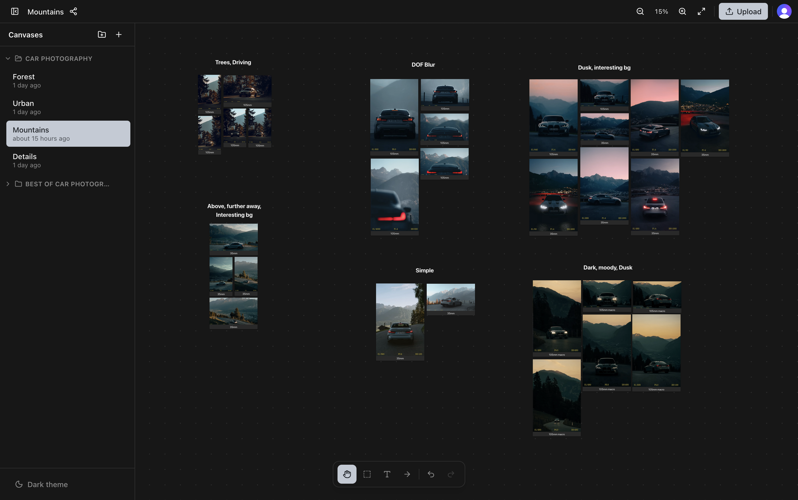

# Pixr — Infinite Canvas Image Board

Organize images on infinite, pannable/zoomable canvases. Multiple named canvases, folders, drag-and-drop uploads, copy/paste, real-time sync across all connected clients.

Usecases: Plan Shoots, Share plan with Client, Collect Inspos, Show of your work



> **Note:** Images by North Borders on YouTube ([God Was On My Side For This Photoshoot... (4K POV) ~ North Borders](https://youtu.be/ToOZcZ9meYE?si=O7eS8UhlcpniW0CQ))

**Stack:** React + Vite + TypeScript · Convex (backend & realtime) · Clerk (auth) · Cloudflare R2 (storage) · Cloudflare Pages (hosting) · Tailwind CSS v4 + shadcn/ui

---

## Local Development

### Prerequisites

- Node.js 18+
- Docker Desktop (for MinIO, which emulates R2 locally)

### 1. Install dependencies

```bash
npm install
```

### 2. Start MinIO

MinIO provides an S3-compatible API locally that mirrors Cloudflare R2.

```bash
docker compose up -d
```

MinIO API runs on `:9000`, console on `:9001` (login: `minioadmin` / `minioadmin`).

### 3. Configure Clerk

Create a [Clerk](https://clerk.com) application and note your publishable key. Create a `.env.local` file:

```bash
VITE_CLERK_PUBLISHABLE_KEY=pk_test_...
```

### 4. Start Convex

```bash
npx convex dev
```

On first run this creates a local Convex project and writes `VITE_CONVEX_URL` to `.env.local` automatically.

Set the storage environment variables so Convex can talk to MinIO:

```bash
npx convex env set S3_ENDPOINT http://localhost:9000
npx convex env set S3_BUCKET canvas-images
npx convex env set S3_ACCESS_KEY_ID minioadmin
npx convex env set S3_SECRET_ACCESS_KEY minioadmin
npx convex env set S3_REGION us-east-1
npx convex env set S3_FORCE_PATH_STYLE true
```

Keep `npx convex dev` running — it watches `convex/` and hot-deploys changes.

### 5. Start the frontend

```bash
npm run dev
```

Open [http://localhost:5173](http://localhost:5173).

---

## Production Deployment

### 1. Cloudflare R2

Create a bucket in the [Cloudflare dashboard](https://dash.cloudflare.com) under **R2 Object Storage**.

Set the CORS policy under **R2 → your bucket → Settings → CORS Policy**:

```json
[
  {
    "AllowedOrigins": ["https://your-app-domain.pages.dev"],
    "AllowedMethods": ["GET", "PUT"],
    "AllowedHeaders": ["*"],
    "ExposeHeaders": ["ETag"]
  }
]
```

Generate R2 API credentials under **R2 → Manage R2 API Tokens**. Note your **Account ID** from the Cloudflare dashboard home page.

### 2. Convex backend

```bash
npx convex deploy
```

Set environment variables in the [Convex dashboard](https://dashboard.convex.dev) under **Settings → Environment Variables**:

| Variable                  | Value                                                 |
| ------------------------- | ----------------------------------------------------- |
| `CLERK_JWT_ISSUER_DOMAIN` | Clerk dashboard → **JWT Templates → Convex → Issuer** |
| `S3_ENDPOINT`             | `https://<ACCOUNT_ID>.r2.cloudflarestorage.com`       |
| `S3_BUCKET`               | Your R2 bucket name                                   |
| `S3_ACCESS_KEY_ID`        | R2 API token access key                               |
| `S3_SECRET_ACCESS_KEY`    | R2 API token secret key                               |
| `S3_REGION`               | `auto`                                                |
| `S3_FORCE_PATH_STYLE`     | `true`                                                |

### 3. Cloudflare Pages

Connect your repository in the [Cloudflare Pages dashboard](https://pages.cloudflare.com) and use these build settings:

| Setting                | Value           |
| ---------------------- | --------------- |
| Build command          | `npm run build` |
| Build output directory | `dist`          |

Add environment variables under **Settings → Environment Variables** (Production):

| Variable                     | Value                                                   |
| ---------------------------- | ------------------------------------------------------- |
| `VITE_CLERK_PUBLISHABLE_KEY` | Your Clerk publishable key (`pk_live_...`)              |
| `VITE_CONVEX_URL`            | Your Convex deployment URL (`https://....convex.cloud`) |

Or deploy manually with Wrangler:

```bash
npm run build
npx wrangler pages deploy dist --project-name pixr
```

> **Note:** The repo includes `.npmrc` with `legacy-peer-deps=true` to resolve a peer dependency conflict between `vite-plugin-pwa` and Vite 8 during the Cloudflare Pages build.

---

## Project Structure

```
convex/          # Backend: schema, queries, mutations, HTTP actions (upload URLs, image signing)
src/
  components/    # React components (CanvasView, Sidebar, Toolbar, CanvasImage, etc.)
  hooks/         # useCanvas (pan/zoom/viewport), useImages/useShapes (optimistic local state), useUndoRedo
  lib/           # s3.ts (upload, preprocess, presigned URLs), canvasClipboard.ts (types), env.ts
public/
  icons/         # PWA icons
```

---

## PWA

The app is installable as a Progressive Web App on iOS and Android. On iOS, use **Share → Add to Home Screen**. The app runs in standalone mode (no browser chrome) and is optimized for touch with mobile-specific viewport handling.

## Disclaimer

This Project was "vibe-coded" (heavy use of AI)
